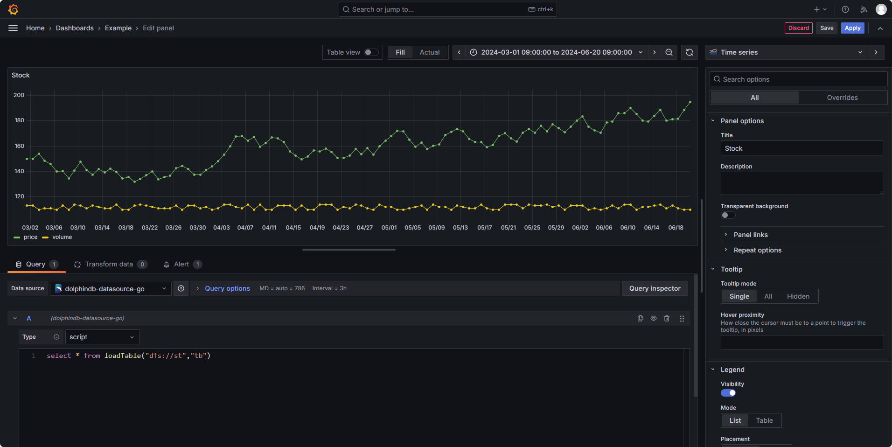

# DolphinDB Grafana DataSource Plugin Go

<p align='center'>
    
</p>

<p align='center'>
    <a href='https://github.com/dolphindb/api-go/releases' target='_blank'>
        
    </a>
</p>

## English | [中文](./README.zh.md)

Grafana is an open-source data visualization web application that excels at dynamically displaying time-series data and supports multiple data sources. By configuring connected data sources and writing query scripts, users can display data charts in the browser.

DolphinDB has developed the Grafana data source plugin (dolphindb-datasource-next), allowing users to interact with DolphinDB by writing query scripts and subscribing to streaming tables on the Grafana dashboard, achieving visualization of DolphinDB time-series data.



## Installation Guide

#### 1. Install Grafana
Visit the Grafana official website: https://grafana.com/oss/grafana/ to download and install the latest open-source version (OSS, Open-Source Software).

#### 2. Install the dolphindb-datasource plugin
Download the latest version of the plugin package from [releases](https://github.com/dolphindb/grafana-datasource/releases), such as `dolphindb-datasource.v2.0.900.zip`.

Extract the dolphindb-datasource-next folder from the package to the following paths (create the plugins directory manually if it doesn't exist):

- Windows: `<grafana install directory>/data/plugins/`
- Linux: `/var/lib/grafana/plugins/`

In the plugins directory, the file structure should look like this:

```
plugins
├── dolphindb-datasource-next
│   ├── LICENSE
│   ├── README.md
│   ├── components
│   ├── go_plugin_build_manifest
│   ├── gpx_dolphindb_datasource_windows_amd64.exe
│   ├── img
│   ├── module.js
│   ├── static
│   └── plugin.json
├── other_plugin_1
├── other_plugin_2
└── ...
```

#### 3. Modify the Grafana configuration file to allow loading unsigned dolphindb-datasource plugins
Read https://grafana.com/docs/grafana/latest/administration/configuration/#configuration-file-location  
Open and edit the configuration file:

Uncomment `allow_loading_unsigned_plugins` under the `[plugins]` section and set it to `dolphindb-datasource-next`, changing the following:
```ini
# Enter a comma-separated list of plugin identifiers to identify plugins to load even if they are unsigned. Plugins with modified signatures are never loaded.
;allow_loading_unsigned_plugins =
```
to:
```ini
# Enter a comma-separated list of plugin identifiers to identify plugins to load even if they are unsigned. Plugins with modified signatures are never loaded.
allow_loading_unsigned_plugins = dolphindb-datasource-next
```

Note: Every time you change the configuration, you need to restart Grafana.

#### 4. Start or restart the Grafana process or service

https://grafana.com/docs/grafana/latest/setup-grafana/start-restart-grafana/

### Verify Plugin Loading
You should see logs similar to the following in the Grafana startup logs:
```log
WARN [05-19|12:05:48] Permitting unsigned plugin. This is not recommended logger=plugin.signature.validator pluginID=dolphindb-datasource-next pluginDir=<grafana install directory>/data/plugins/dolphindb-datasource-next
```

Log file paths:
- Windows: `<grafana install directory>/data/log/grafana.log`
- Linux: `/var/log/grafana/grafana.log`

Or visit the following link and see that the DolphinDB plugin is in the Installed state:  
http://localhost:3000/plugins

## Usage Guide

### 1. Open and log in to Grafana
Open http://localhost:3000  
The initial username and password are both admin.

### 2. Create a new DolphinDB data source
Open http://localhost:3000/datasources or click `Configuration > Data sources` in the left navigation to add a data source. Search for and select dolphindb, configure the data source, and click `Save & Test` to save the data source.

### 3. Create a new Panel to visualize DolphinDB time-series data by writing query scripts or subscribing to streaming tables
Open or create a new Dashboard, edit or create a new Panel, and select the data source added in the previous step in the Data source property of the Panel.

#### 3.1 Write a script to execute queries and visualize the returned time-series table
1. Set the query type to `Script`.
2. Write the query script, and the last statement of the code needs to return a table.
3. After writing, press `Ctrl + S` to save, or click the refresh button (Refresh dashboard) on the page to send the Query to the DolphinDB database for execution and display the chart.
4. Adjust the height of the code editor by dragging the bottom border.
5. Click the `Save` button in the upper right corner to save the panel configuration.

The dolphindb-datasource plugin supports variables such as:
- `$__timeFilter` variable: The value is the time range on the panel's timeline. For example, if the current timeline range is `2022-02-15 00:00:00 - 2022.02.17 00:00:00`, the `$__timeFilter` in the code will be replaced with `pair(2022.02.15 00:00:00.000, 2022.02.17 00:00:00.000)`.
- `$__interval` and `$__interval_ms` variables: The values are the time grouping intervals automatically calculated by Grafana based on the timeline range and screen pixels. `$__interval` will be replaced by the corresponding DURATION type in DolphinDB; `$__interval_ms` will be replaced by milliseconds (integer).
- Query variables: Generate dynamic values or option lists through SQL queries.

For more variables, please refer to https://grafana.com/docs/grafana/latest/variables/

#### 3.2 Subscribe to and visualize streaming tables in DolphinDB in real-time
Requirements: DolphinDB server version not lower than 2.00.9 or 1.30.21  
1. Set the query type to `Streaming`.
2. Fill in the name of the streaming table to subscribe to.
3. Click the Save button.
4. Change the time range to `Last 5 minutes` (must include the current time, such as Last x hour/minutes/seconds, not a historical time range, otherwise no data will be visible).
5. Click the `Save` button in the upper right corner to save the panel configuration.

### 4. Refer to the documentation to learn how to use Grafana
https://grafana.com/docs/grafana/latest/

### FAQ
Q: How to set the dashboard auto-refresh interval?  
A:   
For script type, open the dashboard and select the auto-refresh interval from the dropdown menu to the right of the refresh button in the upper right corner.  
For streaming table type, the data is real-time, no need to set.

To customize the refresh interval, open `dashboard settings > Time options > Auto refresh` and enter the custom interval.  
To define a refresh interval smaller than 5s, such as 1s, follow these steps:  
Modify the Grafana configuration file:
```ini
[dashboards]
min_refresh_interval = 1s
```
After modification, restart Grafana.  
(Reference: https://community.grafana.com/t/how-to-change-refresh-rate-from-5s-to-1s/39008/2)

## Build and Development Guide
```shell
# Install the latest version of nodejs
# https://nodejs.org/en/download/current/

git clone https://github.com/dolphindb/grafana-datasource-go.git

cd grafana-datasource-go

# Install project dependencies
npm i

# Development
npm run dev

# Build
npm run build
mage
# After completion, the artifacts are in the dist folder. Rename out to dolphindb-datasource-next and compress it into a .zip file.
```